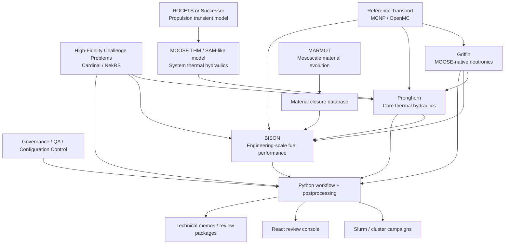

# Professional Extension: Integrated NTP Multiphysics Architecture

## Purpose

The current demo project is a communication artifact. It shows initiative, domain awareness, parser/viewer capability, and an ability to organize nuclear thermal propulsion analysis concepts into an inspectable interface.

In an actual NASA, DOE, or NASA/Amentum reactor analyst role, I would not simply make the demo app larger. I would turn it into a governed, multi-code analysis environment with controlled inputs, pinned software versions, cluster workflows, verification and validation gates, provenance capture, Python postprocessing, and a review-oriented visualization layer.

The React app would not be the source of truth. It would expose the evidence chain.

## Professional Framing

> The demo was intentionally small. It showed that I understood the coupled analysis problem and could build an interface around MCNP, MOOSE-style inputs, BISON-style fuel performance, and propulsion transients. In the role, I would turn that into a controlled integrated-analysis repository. MCNP or OpenMC would provide reference transport; Griffin would provide MOOSE-native neutronics when coupled transient behavior is needed; Pronghorn or MOOSE thermal hydraulics would provide core thermal-hydraulic context; ROCETS or an internal successor would provide rocket-engine system transients; BISON would handle engineering-scale fuel performance; MARMOT would provide mesoscale material closures; and Cardinal/NekRS would be used selectively for high-fidelity benchmark cases. Python would own workflow, postprocessing, verification checks, and report generation. The React app would expose provenance, margins, validation status, and uncertainty without replacing the simulation codes.

## Core Principle

The professional architecture should not be:

```text
Everything coupled to everything, all the time.
```

It should be:

```text
A tiered evidence system:
  reference calculations
  reduced-order and engineering-scale models
  coupled production models
  high-fidelity challenge problems
  verification and validation cases
  uncertainty campaigns
  review dashboards
```

A serious multiyear project needs fidelity tiers, traceable data products, and clear decisions about when live coupling is justified versus when offline coupling, reduced closures, or benchmark comparisons are sufficient.

## Code Roles

### MCNP / OpenMC

MCNP and OpenMC occupy the reference-transport layer. They provide high-fidelity neutronics calculations, reference spectra, tally data, power distributions, depletion or burnup context, and uncertainty estimates.

MCNP can serve as a licensed reference calculation path. OpenMC can serve as an open, scriptable Monte Carlo path. Their outputs should be parsed, normalized, projected, and archived as controlled data products.

### Griffin

Griffin is the MOOSE-native reactor-physics layer. It provides the coupled transient neutronics path for steady-state solutions, kinetics, feedback, depletion context, decay heat, and power fields for Pronghorn and BISON.

MCNP/OpenMC and Griffin should complement each other. Monte Carlo provides high-fidelity reference transport; Griffin provides the MOOSE-native coupled production path.

### Cardinal + NekRS

Cardinal and NekRS provide the selective high-fidelity benchmark route. This layer is appropriate for detailed coolant-channel CFD, conjugate heat transfer, hot-channel benchmarks, pressure-drop closures, and code-to-code comparisons against Pronghorn or MOOSE thermal hydraulics.

This should not be the default production path unless the analysis truly requires the cost.

### Pronghorn

Pronghorn is the intermediate-fidelity core thermal-hydraulics layer. It can represent multidimensional core-scale coolant temperature, flow distribution, hot-channel behavior, and coarse thermal-margin mapping.

In this architecture, Pronghorn receives power from Griffin or mapped Monte Carlo data and provides thermal-hydraulic fields or boundary conditions to BISON.

### MOOSE Thermal Hydraulics / SAM-like System Model

A MOOSE thermal-hydraulics layer, SAM-like model, NPSS-style model, Modelica model, or internal NASA propulsion-cycle tool can sit between ROCETS and Pronghorn.

Its role is to provide loop, plenum, turbomachinery, pressure, coolant-temperature, and mass-flow histories.

### ROCETS or Replacement

ROCETS is useful as a rocket-engine transient reference or heritage propulsion-cycle model. In a professional project, it should either be used as the authoritative propulsion transient model or replaced by an internal tool that better reflects the program's current modeling ecosystem.

Its outputs should be controlled time histories: power demand, hydrogen mass flow, coolant inlet temperature, pressure, turbopump state, startup, shutdown, restart, and abort schedules.

### BISON

BISON is the engineering-scale fuel-performance layer. It consumes power histories, thermal-hydraulic boundary conditions, material-property tables, and controlled meshes.

It produces fuel temperature, thermal gradients, stress and strain, swelling or damage metrics, coating or barrier margin metrics, hydrogen exposure metrics, and fuel-performance review quantities.

### MARMOT

MARMOT is the mesoscale material-evolution layer. It should not replace BISON. It should inform BISON material closures:

```text
MARMOT RVE calculations
  -> reduced effective material-property tables
    -> BISON engineering-scale material models
      -> fuel-performance margins
```

MARMOT is appropriate for graphite or cermet matrix evolution, coating/barrier degradation, grain-boundary effects, thermal-conductivity degradation, hydrogen damage factors, swelling closure data, irradiation damage proxies, and fuel-particle/matrix interface behavior.

### Python Postprocessing

Python owns workflow glue and evidence production:

- parsing code outputs,
- normalizing power and energy deposition,
- projecting fields between meshes,
- checking unit consistency,
- checking integral conservation,
- building postprocessor tables,
- generating validation comparisons,
- building uncertainty summaries,
- producing review-ready plots and reports,
- exporting static artifacts for the React app.

### React Review Application

The React app is a review console, not a computational authority. It should answer:

- What ran?
- Which code version?
- Which input deck?
- Which mesh?
- Which material table?
- Which cross-section library?
- Which Slurm job?
- Which commit?
- Which assumptions?
- Which validation case?
- Which margins changed?

## Architecture Diagram



## Professional Repository Structure

The upstream simulation codes should generally not be vendored into the analysis repository. The repository should store input decks, coupling maps, reduced data products, workflow definitions, postprocessing scripts, app code, metadata, tests, gold files, and documentation.

```text
ntp-integrated-analysis/
  project/
    mission_statement.md
    scope.md
    assumptions_and_limitations.md
    analysis_objectives.md
    risk_register.md

  governance/
    requirements/
    v_and_v/
    configuration_control/
    compliance/

  environment/
    spack.yaml
    conda-lock.yml
    modules/
    containers/
    versions/

  workflows/
    campaign_config.yml
    slurm/
    snakemake/
    provenance/

  geometry/
    cad/
    meshes/
      manifests/
      exodus/
      generation/
      qa/

  data/
    nuclear_data/
    materials/
      source/
      marmot_reduced/
      approved/
    transients/
    validation/

  neutronics/
    mcnp/
      inputs/
      parsing/
      maps/
    openmc/
      models/
      scripts/
      tallies/
    griffin/
      inputs/
      cross_sections/
      verification/

  thermal_hydraulics/
    propulsion_cycle/
      rocets/
      replacement_candidates/
    moose_thm/
    pronghorn/
    cardinal_nekrs/

  fuel_performance/
    bison/
      inputs/
      metadata/
      verification/
    marmot/
      inputs/
      meshes/
      parameters/
      reduction/

  coupling/
    schemas/
    maps/
    conservative_projection/
    time_alignment/

  postprocessing/
    ntp_post/
      io/
      neutronics/
      thermal_hydraulics/
      fuel/
      validation/
      plots/
      reports/

  verification/
    analytic/
    code_to_code/
    regression/
    gold/

  validation/
    benchmark_cases/
    comparison_scripts/
    reports/

  uncertainty/
    parameters/
    campaigns/
    scripts/

  app/
    src/
      features/
        overview/
        neutronics/
        thermalHydraulics/
        fuelPerformance/
        materials/
        validation/
        provenance/
      data/
      styles/
      tests/

  reports/
    technical_memos/
    design_reviews/
    validation_reviews/
    campaign_summaries/

  tools/
    check_case_manifest.py
    check_paths.py
    check_units.py
    make_release_bundle.py
```

## Professional Data Flow

Every handoff should become a controlled data product.

```text
MCNP/OpenMC output
  -> normalized power map
  -> conservative projection to Griffin/Pronghorn/BISON meshes
  -> provenance record
  -> archived artifact

ROCETS/system transient output
  -> time-aligned coolant boundary histories
  -> Pronghorn and BISON boundary-condition tables
  -> provenance record

MARMOT RVE outputs
  -> reduced material closure tables
  -> BISON material database
  -> uncertainty bounds

NekRS/Cardinal benchmark
  -> HTC and pressure-drop closures
  -> Pronghorn calibration dataset
  -> validation or code-to-code comparison package

BISON outputs
  -> fuel temperature, stress, damage, and margin metrics
  -> postprocessed review products
  -> React visualization bundle
```

Each handoff should record source code version, input deck, mesh, material database, nuclear data library, units, interpolation policy, uncertainty treatment, conservation checks, Slurm job, git commit, analyst, and review status.

## HPC Workflow Pattern

A professional cluster campaign should be reproducible from a manifest, not from ad-hoc terminal history.

```text
campaign YAML
  -> workflow engine
    -> Slurm jobs
      -> code-specific output directories
        -> Python postprocessing
          -> campaign archive
            -> React review bundle
              -> technical memo / review package
```

The campaign manifest should define case family, physics codes used, input decks, mesh versions, material database version, transient profile, random seeds or UQ samples, queue and resource requests, output retention policy, and review status.

## Maturation Plan

### Phase 1: Controlled Demo Upgrade

- Keep the React app as a review console.
- Move synthetic inputs into a controlled examples area.
- Add case manifests and provenance records.
- Add parser validation tests.
- Add static review bundles.

### Phase 2: Single-Physics Verification

- Build verification cases for neutronics, thermal hydraulics, fuel performance, mesoscale materials, and postprocessing.
- Add gold files and regression checks.
- Pin code versions and environments.
- Establish mesh QA and unit checks.

### Phase 3: Coupled Engineering Workflow

- Use Griffin, Pronghorn, BISON, and MARMOT in offline or loosely coupled mode.
- Use ROCETS or a successor system model to generate boundary histories.
- Establish conservative field projection and time-alignment policies.
- Use Python to generate review-ready evidence packages.

### Phase 4: High-Fidelity Challenge Problems

- Use Cardinal/OpenMC/NekRS on selected local benchmark problems.
- Generate closure data for Pronghorn and BISON.
- Compare high-fidelity results against production models.
- Use discrepancies to update uncertainty bounds and model-form error estimates.

### Phase 5: Validation and UQ Campaigns

- Select relevant historical or separate-effects validation cases.
- Define bounded validation claims.
- Run uncertainty and sensitivity studies.
- Produce evidence packages that separate verified, validated, calibrated, and exploratory components.

## Professional Message

This architecture communicates that the demo is not a toy. It is a seed for a serious workflow. The project separates reference physics, production physics, high-fidelity benchmarks, materials modeling, verification, validation, uncertainty quantification, and review visualization.

The end goal is not one heroic all-coupled calculation. The end goal is a credible, inspectable, multiyear analysis environment that can support design review, model improvement, validation planning, and technical communication.